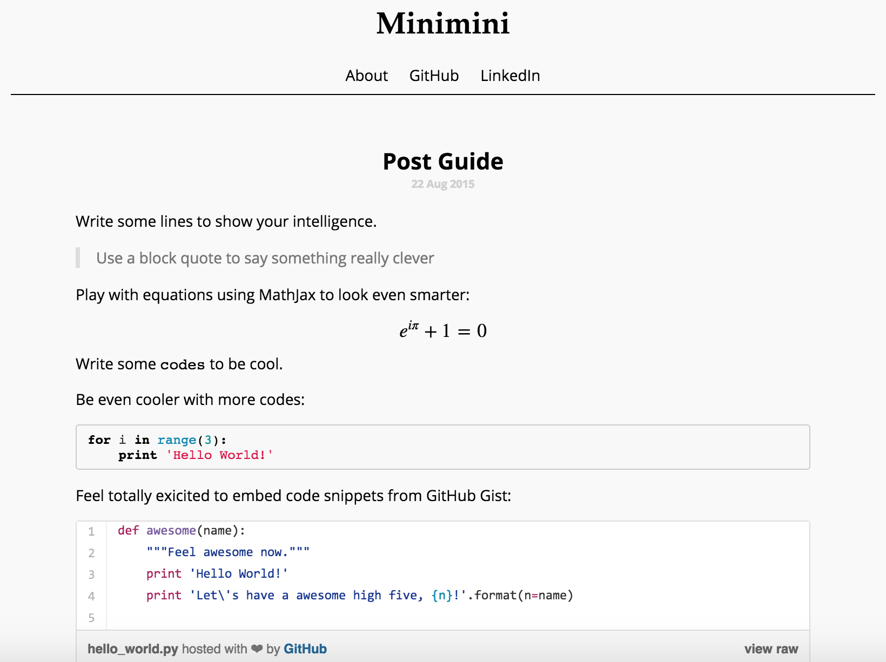

# Minimini

A simple plain white theme of Jekyll.

# Get started

1. [Fork the repository](https://github.com/mikkkee/minimini#fork-destination-box)
2. Clone the repository to your computer.
`git clone https://github.com/mikkkee/minimini.git`
3. Custom site info for yourself by editing `_config.yml`.
4. Run Jekyll to serve site.
`jekyll serve [--watch]`
